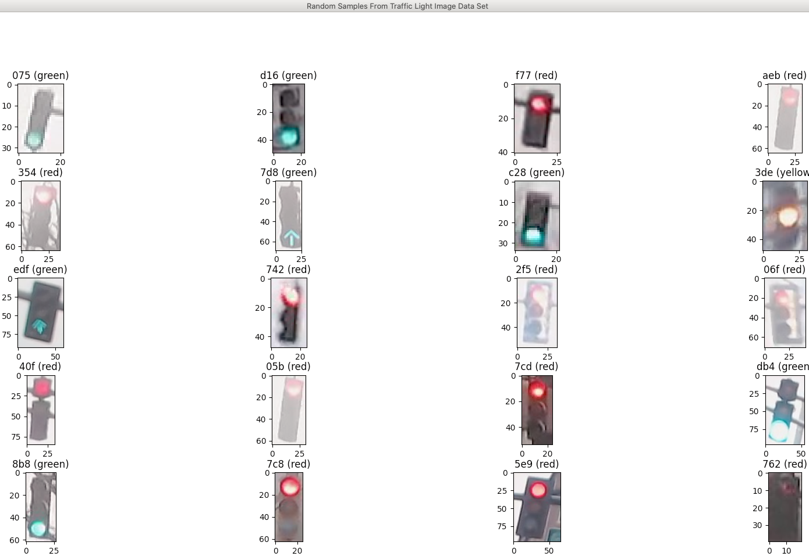
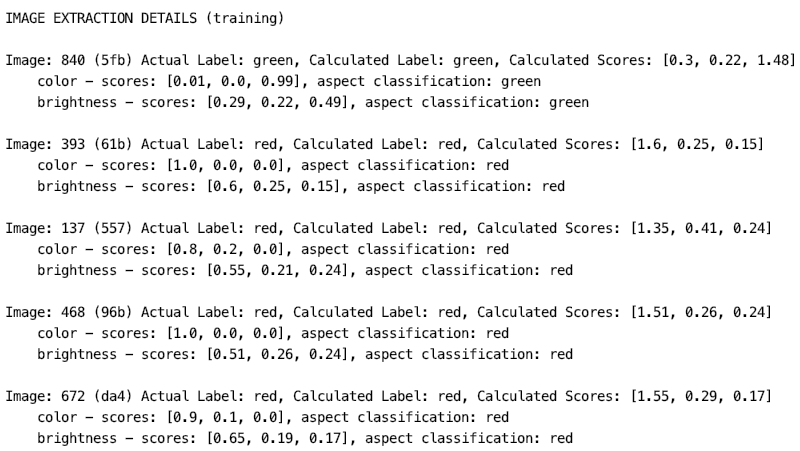
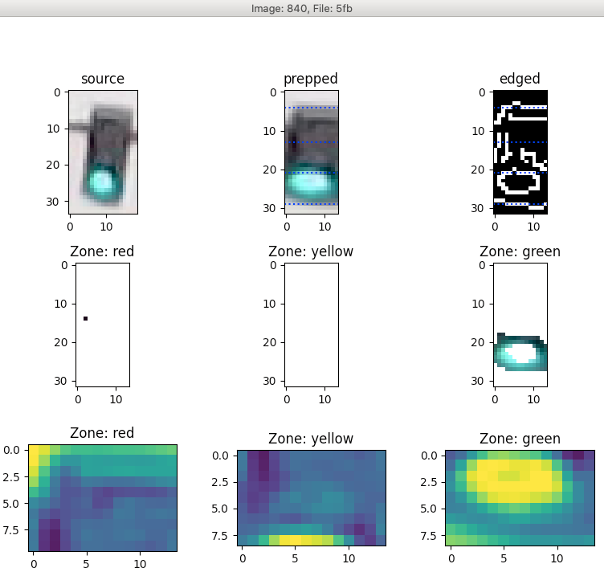
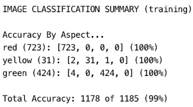

# Traffic Light Classifier
This library began as a class project for Udacity's Intro To Self-Driving Cars Nano Degree Program.

It uses OpenCV image processing to classify images of traffic lights by their lighted aspect (red, yellow, or green color).

It includes a classifier that utilizes two feature extractors, one for brightness extraction and one for color extraction.

The classifier determines the image's classification as the aspect having the greatest sum of normalized scores from the feature extractors.

In order to understand and tune the feature extractors, I built (and included in this library) a classification results analysis tool, which shows numerically and visually how the extractors operate on each image.

The classifier achieved 99% accuracy across the 1,482 images (included in this library) in both the training and testing data sets. It also classifies no "red" traffic signals as "green", which was a requirement of the project.

As I was working on the project, I began planning the design of a scale model autonomous vehicle that I would like to build. I began generalizing the classifier and analysis tools so that they might serve as the core of an architecture that will process data from a number of sensors that will be attached to the vehicle.


## Table of Contents

* [Dependencies and Pre-requisites](#dependencies-and-pre-requisites)
* [Installation](#installation)
* [Usage](#usage)
* [Feature Extractors](#feature_extractors)
* [Known Issues](#known-issues)
* [Future Plans](#future-plans)
* [Support](#support)
* [Contributing](#contributing)
* [Authors and Acknowledgement](#authors-and-acknowledgement)
* [License](#license)


## Dependencies and Pre-requisites
* Python 3.x and the following libraries
  * cv2, glob, matplotlib, math, numpy, random


## Installation

1. Copy the following files to a directory,
  * traffic_light.py
    * main(), retrieves images, primary classification loop, initiates analysis of classifications
  * classifier.py
    * processes an individual image
  * extractor.py
    * template class for feature extractors
  * extractor_brightness.py
    * feature extractor for brightness
  * extractor_color.py
    * feature extractor for color
  * analyze.py
    * produces detailed and summary analysis based on classification data generated by the classifier
  * helpers.py
    * functions for plotting individual and groups of images
  * utilities.py
    * development support functions, including the color analyzer used to extract hue ranges for the traffic light colors  
2. Unzip the lights.zip file. The following directories should appear. Each directory should contain .jpg images of traffic lights. The images were sourced from https://deeplearning.mit.edu/:
  * traffic_light_images/test/green
  * traffic_light_images/test/red
  * traffic_light_images/test/yellow
  * traffic_light_images/training/green
  * traffic_light_images/training/red
  * traffic_light_images/training/yellow


## Usage
**Image Samples**

Here are samples of images that have been identified by the classifier:


**Configuration**

In the file traffic_light.py, edit the main() function:

Uncomment the dataset that you would like to process.
```
def main():
    DATA_SET = "training"
    #DATA_SET = "test"
```
Here the images are loaded into the IMAGE_LIST...
```
    IMAGE_DIR = "traffic_light_images/" + DATA_SET
    IMAGE_LIST = f.load_dataset(IMAGE_DIR)
```
Here the classify function iterates over the images in IMAGE_LIST. The results are returned in a list of classifications...
```
    classifications = classify(IMAGE_LIST)
```
There are two analysis functions that provide interpretation of the classifications data returned from the classify function.

**display_analysis()** provides detailed information regarding every image processed by the extractors. Set *display_analysis_images* to "True" to view the image files and masks that were generated by the extractors during processing.

**display_summary()** provides summary information regarding the overall performance of the extractors over the entire data set. Set *display_misclassified_data_and_images* to "True" to view the details and images generated by the extractors regarding images that were misclassifed.

```
    display_analysis_images = False
    display_misclassified_data_and_images = True

    a.display_analysis(DATA_SET, IMAGE_LIST, classifications, display_analysis_images)

    a.display_summary(DATA_SET, IMAGE_LIST, classifications, display_misclassified_images)
```

**Running**
1. In a terminal, navigate to the directory containing the source files,
2. Execute `python3 traffic_light.py`.

**Sample Output - display_analysis()**


**Sample Output - display_analysis() (images)**


**Sample Output - display_summary()**




## Feature Extractors
The traffic light classifier utilizes two feature extractors:

* Brightness Feature Extractor
  1. Uses Canny edge detection to organize the image into 3 regions (top aspect - red, middle aspect - yellow, and bottom aspect - green).
  2. Converts the image to the HSV colorspace.
  3. Scores each aspect for brightness as the sum of the HSV "V" (value) channel values in each region.
  4. Normalizes the three aspect scores.

* Color Feature Extractor
  1. Converts the image to the HSV colorspace.
  2. Filters the image to only include pixels with HSV "S"(saturation) channel values that are at least one standard deviation above the mean saturation for the image. This step removes virtually all pixels that will not be used to determine the signal color of the image.
    * In a separate step, a range of hues that represent each lighted aspect were extracted from a sample of testing data set images.
  4. Counts the number of pixels that appear in the image in the range of hues specified for each possible signal color (red, yellow, and green).
  5. Normalizes the three aspect scores.


## Known Issues

None.

## Future Plans

In order to get a full overview of autonomous vehicle engineering, I plan to build a scale model autonomous vehicle. That project will expand this classifier and analysis tool into a larger project that also includes, robot development, localization, route planning, and vehicle control.


## Support

Please open an issue to receive help.


## Contributing

Pull requests are welcome. Please open an issue to discuss any changes you would like to make or see.


## Authors and Acknowledgement

This project was initially submitted as coursework for the [Udacity - Introduction to Self-Driving Cars Nano Degree](https://www.udacity.com/course/intro-to-self-driving-cars--nd113)

* Unit: Computer Vision and Classification
* Project: Traffic Light Classifier

## License

[MIT](https://choosealicense.com/licenses/mit/)
